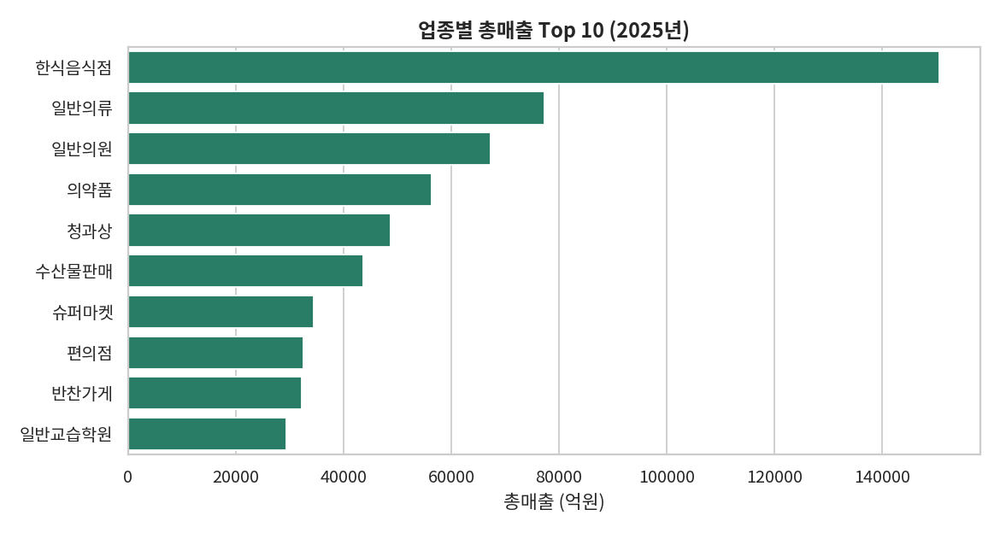
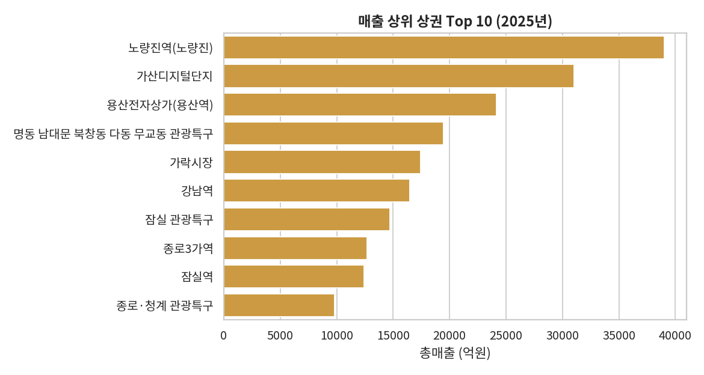
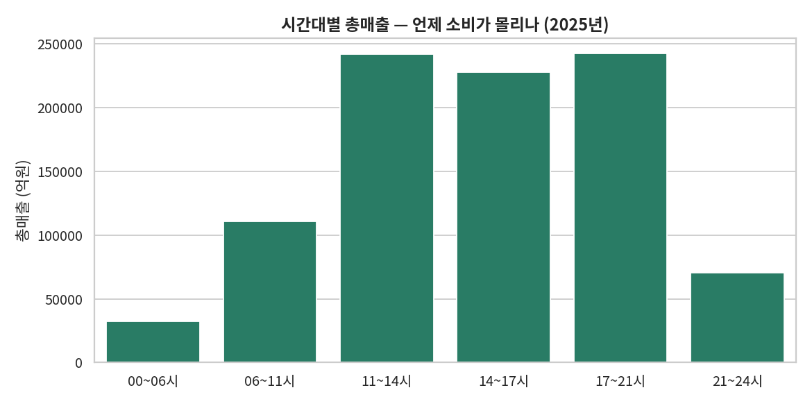
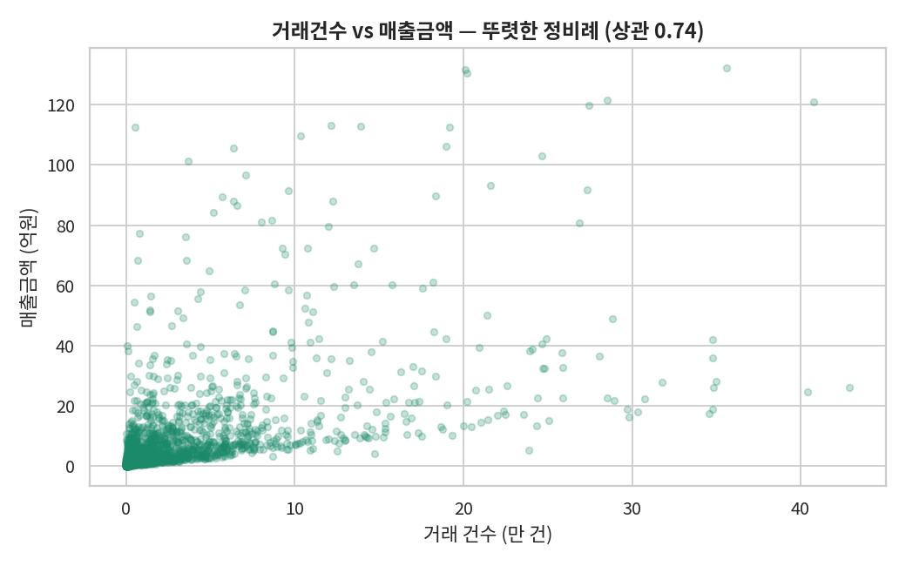
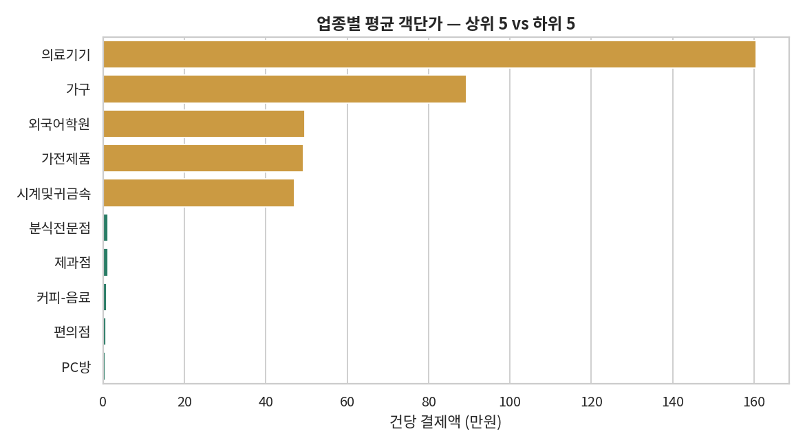
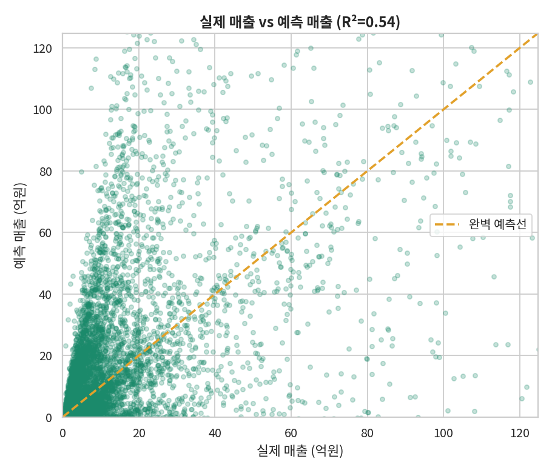

# 🏙️ 서울시 상권 추정매출 분석 (2025년)

> 서울 어디에서, 어떤 업종이, 언제, 누구에게 가장 많이 팔릴까?
> 카드·은행이 실제로 쓰는 상권 데이터를 분석해 소비의 구조를 밝혀본 프로젝트.

**한 줄 요약:** 서울시 상권분석 데이터(85,732건)를 분석해 소비가 **역세권 음식업 · 저녁 시간대 · 40~60대 중장년**에 집중됨을 확인하고, 가맹점 유치·대출 심사 등 **금융 활용 방안**을 제안했습니다.

---

## 1. 분석 배경 & 질문 (Why)
상권마다 매출 규모와 소비 패턴이 다르다. "어디서·무엇이·언제·누구에게" 팔리는지를 알면 창업 입지, 마케팅 타이밍, 금융상품 설계에 활용할 수 있다.
- **Q1.** 어떤 업종의 매출이 가장 높은가?
- **Q2.** 매출이 높은 상권 Top 10은 어디인가?
- **Q3.** 하루 중 언제 소비가 몰리는가?
- **(심화)** 주 소비층은 어느 연령대·성별인가? 주중과 주말은 다른가?

## 2. 데이터 (What)
- **출처:** 공공데이터포털 – 서울시 상권분석서비스(추정매출-상권), 2025년
- **규모:** 85,732행 × 55열 (2025년 4개 분기 · 상권 1,577개 · 업종 62종)
- **주요 컬럼:** 상권_코드_명, 서비스_업종_코드_명, 당월_매출_금액, 시간대별·요일별·성별·연령대별 매출

## 3. 분석 과정 (How)
1. **불러오기** → `pandas`로 로드 (인코딩 `cp949`)
2. **전처리** → 매출 0 이하 제외
3. **집계** → `groupby`로 업종별·상권별·시간대별 매출 합산 (단위: 억원)
4. **시각화** → `matplotlib`·`seaborn`으로 막대그래프
5. **인사이트 도출** → 성별·연령대·주중주말까지 교차 확인

## 4. 결과 (Findings)

**① 업종별 총매출 Top 10 — 한식음식점이 압도적**


**② 매출 상위 상권 Top 10 — 역세권·업무지구 중심**


**③ 시간대별 총매출 — 점심~저녁에 집중**


## 5. 인사이트 & 제안 (So what) ⭐

- **① 소비는 '역세권 생활밀착 업종'에 집중** — 매출 1위 업종은 한식음식점, 1위 상권은 노량진역. 신규 창업·입지 선정 시 **역세권 음식업이 안정적 후보**임을 시사.
- **② 소비 골든타임은 점심-저녁(11-21시)** — 전체 매출의 약 **77%**가 이 시간대에 발생(저녁 17-21시가 최고). **마케팅·인력 배치를 이 시간에 집중**하는 것이 효율적.
- **③ 핵심 소비층은 40~60대 중장년** — 40대 이상이 매출의 약 **70%**(60대 이상 단일 최대 25.3%). '20대 중심' 통념과 달리 **중장년 타깃 시장이 크다.**
- **④ 주중이 주말보다 강하다** — 일평균 매출 주중(약 14조) > 주말(약 11.4조). **업무지구 평일 소비가 서울 상권의 근간.**

### 💰 금융 관점 활용 방안
이 분석은 카드사·은행 실무에 바로 연결된다.
- **가맹점 유치**: 매출 상위 역세권 상권에 영업 우선순위 부여
- **소상공인 대출 심사**: 상권·업종별 매출 규모를 리스크 참고자료로 활용
- **금융상품 설계**: 중장년 중심 소비 데이터를 타깃 상품 기획의 근거로 활용

## 6. 사용 기술
`Python` · `pandas` · `matplotlib` · `seaborn` · `Google Colab`

## 7. 회고 (배운 점)
- 55개 컬럼 중 **분석 질문에 필요한 컬럼만 골라 쓰는** 연습이 되었다.
- 매출을 '원' → '억원'으로 바꾸니 **차트 가독성**이 크게 좋아졌다.
- 단순 순위(업종·상권)를 넘어 **시간대·연령대까지 쪼개 보니** 훨씬 풍부한 이야기가 나왔다 → *"데이터를 어떻게 나눠 보느냐가 인사이트를 만든다."*

---
### 실행 방법
```python
# 1) 한글 폰트 (코랩에서 최초 1회)
!apt -qq install fonts-nanum
# 2) CSV 업로드 후 실행
python analysis_sangkwon.py   # charts/ 폴더에 결과 이미지 생성
```
*데이터 출처: 공공데이터포털(data.go.kr) · 서울특별시*

---

# 🔬 심화 분석 — 관계분석 & 매출 예측

> 앞선 '현황 분석'에서 한 단계 나아가, 변수 간 관계를 밝히고 간단한 예측 모델을 만들어본 확장편.

## 심화 1. 관계분석 — 무엇이 매출을 만드는가?

Q. 거래 건수가 많으면 매출도 높을까?
거래건수와 매출금액의 상관계수는 0.74로, 강한 정비례 관계를 확인했다. 즉 서울 상권 매출의 핵심 동력은 '한 번에 큰 결제'보다 '얼마나 자주 결제가 일어나는가(방문·거래 횟수)'다.



Q. 그렇다면 '건당 결제액(객단가)'이 높은 업종은?
매출금액 ÷ 거래건수로 객단가라는 새 변수를 만들어 업종별로 비교했다. 의료기기·병원 등 고가·저빈도 업종은 객단가가 높고(1위 의료기기 약 161만원), 편의점·음식점 등 저가·고빈도 업종은 객단가가 낮았다.



## 심화 2. 예측 — 거래 건수로 매출을 예측할 수 있을까?

거래건수(X)로 매출금액(y)을 예측하는 선형회귀 모델을 만들었다.
- 데이터를 학습용 80% / 검증용 20%로 나눠(train/test split) 과적합을 방지
- 검증 결과 R² = 0.54 — 거래건수 하나만으로 매출 변동의 약 54%를 설명
- 학습된 계수상 거래 1건당 매출 약 4만원 증가 (= 평균 객단가에 해당)



## 심화 인사이트 & 제안 ⭐
- ① 매출의 핵심은 '거래 빈도' (상관 0.74) → 상권 활성화·마케팅은 '객단가 인상'보다 '방문·거래 횟수 늘리기'에 초점.
- ② 업종은 두 유형으로 나뉜다 — 고가·저빈도(의료·전문서비스) vs 저가·고빈도(음식·편의). → 업종 특성에 맞는 차별화 전략 필요.
- ③ 간단한 모델로도 절반 이상 예측 가능(R²=0.54) → 거래건수는 강력한 예측 변수. 다만 나머지 46%는 설명 못 하므로, 업종·상권·유동인구 변수를 추가하면 정확도 향상 여지가 있다.

### 💰 금융 관점 활용
- 가맹점 매출 추정: 거래 건수만으로도 가맹점의 대략적 매출 규모를 추정 → 신용 심사·한도 산정의 보조 지표.
- 업종 리스크 구분: 고객단가·저빈도 업종은 경기 민감도가 달라, 업종별 대출 리스크 차등화의 근거로 활용 가능.

## 사용 기술 (심화)
`scikit-learn`(LinearRegression) · `train_test_split` · `R² score` · 피처 엔지니어링(객단가)

## 회고 (배운 점)
- 상관관계 ≠ 인과관계: 함께 움직인다고 해서 하나가 원인이라 단정할 수 없음을 유의.
- R²=0.54의 의미: 모델이 완벽하지 않음을 숨기지 않고 '변수를 더하면 개선된다'는 다음 방향까지 제시하는 것이 정직한 분석.
- 단순 집계(현황)에서 관계·예측(모델링)으로 넘어오며 분석의 깊이를 한 단계 확장했다.

---
### 실행 방법 (심화 분석)
```python
# 코랩에서: 한글 폰트 설치 후 CSV 업로드 → 실행
!apt -qq install fonts-nanum
python analysis_advanced.py   # charts/ 폴더에 adv1~adv3 이미지 생성
```
* scikit-learn은 코랩에 기본 설치되어 있어 별도 설치가 필요 없습니다.
* 사용 데이터: 서울시 상권분석서비스(추정매출-상권) — 기초 분석과 동일한 CSV.
